# Lab 1

## Lab 1-1

### 1. Upload the files to http://www.VirusTotal.com/ and view the reports. Does either file match any existing anti-virus signatures?

##### Lab01-01.exe

| Hash Type | Hash Value                                                   |
| --------- | ------------------------------------------------------------ |
| MD5       | bb7425b82141a1c0f7d60e5106676bb1                             |
| SHA-1     | 9dce39ac1bd36d877fdb0025ee88fdaff0627cdb                     |
| SHA-256   | 58898bd42c5bd3bf9b1389f0eee5b39cd59180e8370eb9ea838a0b327bd6fe47 |

We can see that **Lab01-01.exe** was first submitted to Virustotal on 2012-02-16 07:31:54 and since then it has as 41/68 detection rate:

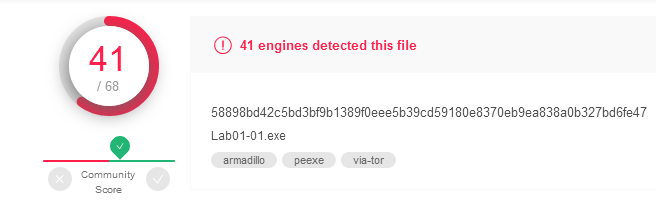

##### Lab01-01.dll

| Hash Type | Hash Value                                                   |
| --------- | ------------------------------------------------------------ |
| MD5       | 290934c61de9176ad682ffdd65f0a669                             |
| SHA-1     | a4b35de71ca20fe776dc72d12fb2886736f43c22                     |
| SHA-256   | f50e42c8dfaab649bde0398867e930b86c2a599e8db83b8260393082268f2dba |

File **Lab01-01.dll** was first submitted to Virustotal on 2011-07-04 19:57:48 and since then it has as 32/68 detection rate:


### 2. When were these files compiled?

##### Lab01-01.exe

*PEview > IMAGE_FILE_HEADER*

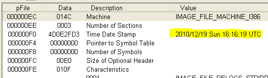

##### Lab01-01.dll

*PEview > IMAGE_FILE_HEADER*

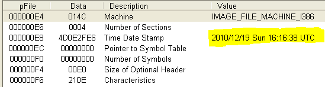

### 3. Are there any indications that either of these files is packed or obfuscated? If so, what are these indicators?

##### Lab01-01.exe

*PEview* 

| Name Section | Virtual Size | Size of raw data |
| ------------ | ------------ | ---------------- |
| .text        | 0970         | 1000             |
| .rdata       | 02B2         | 1000             |
| .data        | 00FC         | 1000             |

In the table above, we need to check the different sizes of memory. One of the indicators of a packed file is that the virtual memory is larger than the raw data (the amount of space it occupies on the disk), what is not the case here.

Another indicator of the file not being packed is that we can see multiple strings. If we had a packed file, it would be hard to identify readable strings.

##### Lab01-01.dll

*PEview* 

| Name Section | Virtual Size | Size of raw data |
| ------------ | ------------ | ---------------- |
| .text        | 039E         | 1000             |
| .rdata       | 23FC6        | 24000            |
| .data        | 006C         | 1000             |
| .reloc       | 0204         | 1000             |

In the table above, we need to check the different sizes of memory. One of the indicators of a packed file is that the virtual memory is larger than the raw data (the amount of space it occupies on the disk), what is not the case here.

Another indicator of the file not being packed is that we can see multiple strings. If we had a packed file, it would be hard to identify readable strings.

### 4. Do any imports hint at what this malware does? If so, which imports are they?

##### Lab01-01.exe

- **FindNextFileA** and **FindFirstFileA**, both functions gives us indicators that the program performs some search/scan on the system.

- **UnmapViewOfFile**, **MapViewOfFile** and **CreateFileMappingA**, indicates that the program manipulates file(s) in memory.

##### Lab01-01.dll

- **CreateProcessA**, indicates that the program creates another process.

- Multiple **WS2_32.dll** functions (**send**, **recv**, **socket** and etc), which show that the program tries to establish a connect with other machine.

- **Sleep**, indicates that the program at some point will "hibernate" for a period of time.

### 5. Are there any other files or host-based indicators that you could look for on infected systems?

##### Lab01-01.exe

*Strings*

```
C:\windows\system32\kerne132.dll
```

##### Lab01-01.dll

There are no indicators.

### 6. What network-based indicators could be used to find this malware on infected machines?

127.26.152.13  

### 7. What would you guess is the purpose of these files?

The propose of these file is to scan the system for a file(s), manipulate it and send information to other machine, maybe 127.26.152.13.

## Lab 1-2

### 1. Upload the Lab01-02.exe file to http://www.VirusTotal.com/. Does it match any existing antivirus definitions?

| Hash Type | Hash Value                                                   |
| --------- | ------------------------------------------------------------ |
| MD5       | 8363436878404DA0AE3E46991E355B83                             |
| SHA-1     | 5A016FACBCB77E2009A01EA5C67B39AF209C3FCB                     |
| SHA-256   | C876A332D7DD8DA331CB8EEE7AB7BF32752834D4B2B54EAA362674A2A48F64A6 |

We can see that **Lab01-02.exe** was first submitted to Virustotal on 2011-07-02 17:02:09 and since then it has as 45/69 detection rate:

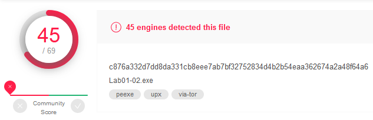

### 2. Are there any indications that this file is packed or obfuscated? If so, what are these indicators? If the file is packed, unpack it if possible.

Running the PEiD program it show that the file is packed with UPX

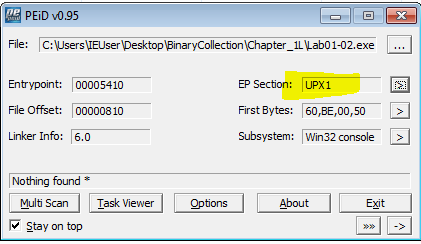

```powershell
C:> upx -d Lab01-02.exe 
```

After executing the command above, you can now see on PEiD, that the Entry Point (EP) is at .text section. Also, another proof that we have unpack the file is the information regarding the compiler (Microsoft Visual C++ 6.0).

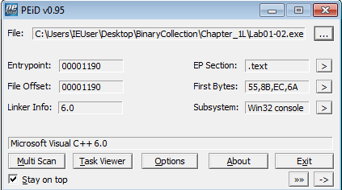

### 3. Do any imports hint at this program’s functionality? If so, which imports are they and what do they tell you?

- **CreateServiceA**, indicates that the program creates, maybe to gain persistence 
- **CreateWaitableTimerA** and **SetWaitableTimer**, indicates that program will "hibernate" for period of time.
- **InternetOpenUrlA** and **InternetOpenA**, indicates that the program intends to perform some HTTP/FTP connects. 

### 4. What host- or network-based indicators could be used to identify this malware on infected machines?

Strings: 

[http://www.malwareanalysisbook.com](http://www.malwareanalysisbook.com/) 

Internet Explorer 8.0  

## Lab 1-3

### 1. Upload the Lab01-03.exe file to http://www.VirusTotal.com/. Does it match any existing antivirus definitions?

| Hash Type | Hash Value                                                   |
| --------- | ------------------------------------------------------------ |
| MD5       | 9c5c27494c28ed0b14853b346b113145                             |
| SHA-1     | 290ab6f431f46547db2628c494ce615d6061ceb8                     |
| SHA-256   | 7983a582939924c70e3da2da80fd3352ebc90de7b8c4c427d484ff4f050f0aec |

We can see that **Lab01-03.exe** was first submitted to Virustotal on 2011-07-04 22:00:08 and since then it has as 61/70 detection rate:

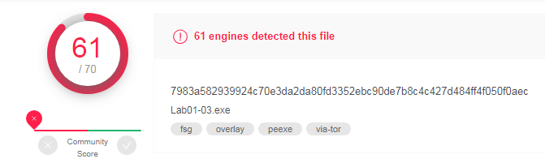

### 2. Are there any indications that this file is packed or obfuscated? If so, what are these indicators? If the file is packed, unpack it if possible.

With the image bellow we can verify the the virtual size is bigger than the raw size.

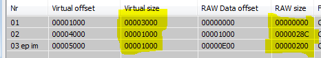

The PEiD program tell us that the file is packed with FSG and it is unable to unpack the file.

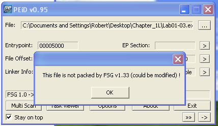

Another indicatior that the program is packed is the few number of import functions: **LoadLibraryA** and **GetProcAddress**. A normal program will never import only two functions

### 3. Do any imports hint at this program’s functionality? If so, which imports are they and what do they tell you?

We can only see two imports: **LoadLibraryA** and **GetProcAddress**. With these functions we know that the actual program will be load on memory.

### 4. What host- or network-based indicators could be used to identify this malware on infected machines?

With the packed file is not possible to have readable strings, so we are unable to provide any indicator. 

## Lab 1-4

### 1. Upload the Lab01-04.exe file to http://www.VirusTotal.com/. Does it match any existing antivirus definitions?

| Hash Type | Hash Value                                                   |
| --------- | ------------------------------------------------------------ |
| MD5       | 625ac05fd47adc3c63700c3b30de79ab                             |
| SHA-1     | 9369d80106dd245938996e245340a3c6f17587fe                     |
| SHA-256   | 0fa1498340fca6c562cfa389ad3e93395f44c72fd128d7ba08579a69aaf3b126 |

We can see that **Lab01-04.exe** was first submitted to Virustotal on 2011-07-06 00:05:42 and since then it has as 57/71 detection rate:

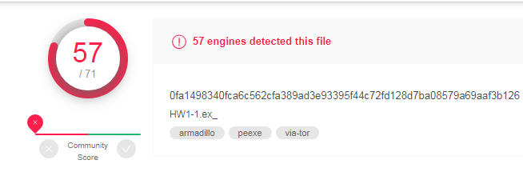

### 2. Are there any indications that this file is packed or obfuscated? If so, what are these indicators? If the file is packed, unpack it if possible.

| Name Section | Virtual Size | Size of raw data |
| ------------ | ------------ | ---------------- |
| .text        | 1000         | 0720             |
| .rdata       | 1000         | 03D2             |
| .data        | 1000         | 014C             |
| .rsrc        | 5000         | 4060             |

In the table above, we need to check the different sizes of memory. One of the indicators of a packed file is that the virtual memory is larger than the raw data (the amount of space it occupies on the disk), what is not the case here.

Another indicator of the file not being packed is that we can see multiple strings. If we had a packed file, it would be hard to identify readable strings.

The last the indicator of not being packed is the compiler information provide by PEiD, which is Microsoft Visual C++ 6.0.

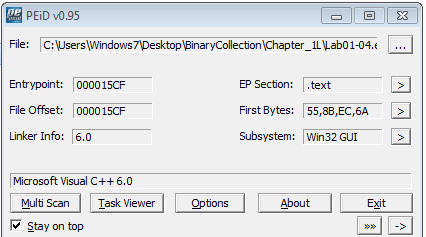

### 3. When was this program compiled?

Fri Aug 30 15:26:59 2019, which is suspicious knowing that the file was submitted to VirusTotal in 2011.

### 4. Do any imports hint at this program’s functionality? If so, which imports are they and what do they tell you?

- **WinExec**, indicates that program will execute another program.
- **OpenProcess** 
- **CreateFileA**, **WriteFile** and **MoveFileA**. indicates that the programs preform some operations with file, like: create, write and copy/cut.
- **GetTempPathA** and **GetWindowsDirectoryA**, indicates that the the program at some point perform some action with these directories, maybe action related with files.
- **FindResourceA** and **LoadResource**, indicates that the program load an resource from the system.

### 5. What host- or network-based indicators could be used to identify this malware on infected machines?

- winlogon.exe - Windows Logon is a program that performs a wide range of critical tasks associated with the Windows sign-in process 
- \system32\wupdmgr.exe - Microsoft Windows is an operating system; a piece of software that acts as a bridge between the hardware and software counterparts of a computer 
- \winup.exe - Most antivirus programs identify winup.exe as malware 
- http://www.practicalmalwareanalysis.com/updater.exe 

### 6. This file has one resource in the resource section. Use Resource Hacker to examine that resource, and then use it to extract the resource. What can you learn from the resource?

With the help of Resource Hacker, we are able to extract an executable. Analyzing the executable we verify the following imports:

- GetTempPathA
- GetWindowsDirectoryA
- WinExec
- URLDownloadToFileA

The extract executable may download a file, put inside of the TMP directory and execute it.